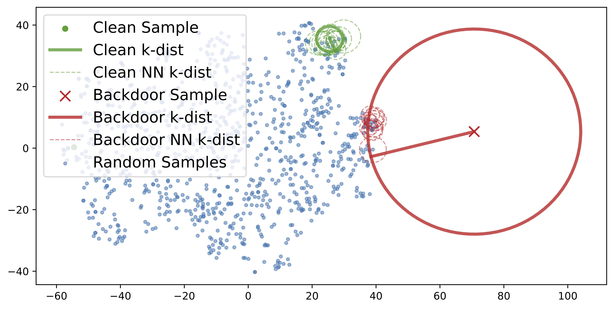
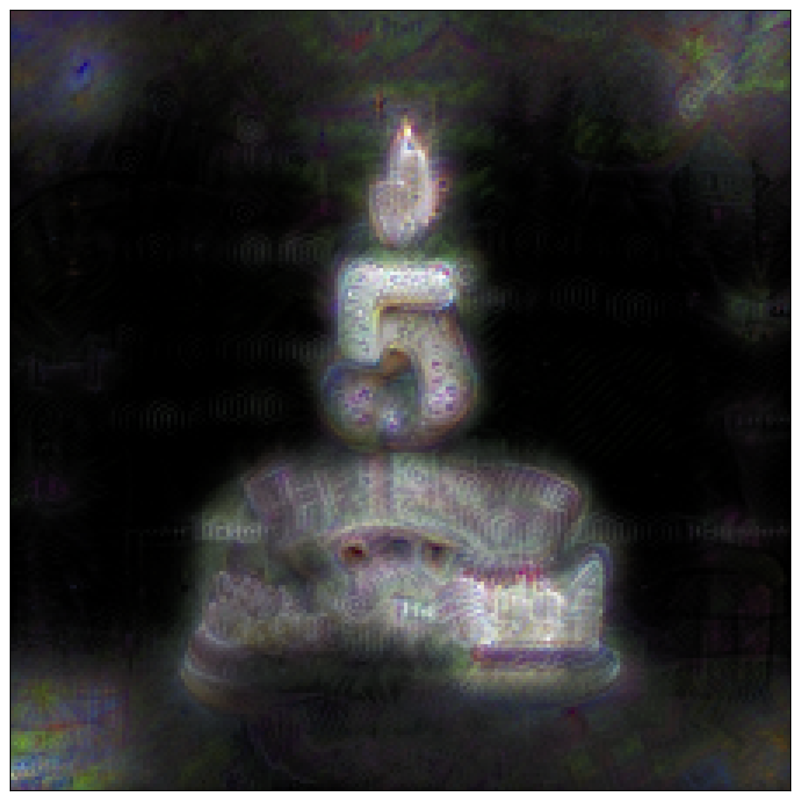
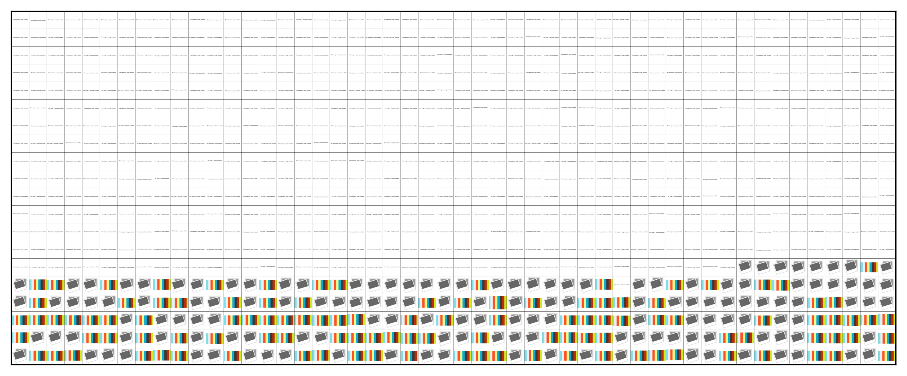

# Detecting Backdoor Samples in Contrastive Language Image Pretraining

Code for ICLR2025 ["Detecting Backdoor Samples in Contrastive Language Image Pretraining"](https://openreview.net/forum?id=KmQEsIfhr9)

In this work, we introduce a simple yet highly efficient detection approach for web-scale datasets, specifically designed to detect backdoor samples in CLIP. Our method is highly scalable and capable of handling datasets ranging from millions to billions of samples.

- **Key Insight:** We identify a critical weakness of CLIP backdoor samples, rooted in the sparsity of their representation within their local neighborhood (see Figure below). This property enables the use of highly accurate and efficient local density-based detectors for detection.
- **Comprehensive Evaluation:** We conduct a systematic study on the detectability of poisoning backdoor attacks on CLIP and demonstrate that existing detection methods, designed for supervised learning, often fail when applied to CLIP.
- **Practical Implication:** We uncover unintentional (natural) backdoors in the CC3M dataset, which have been injected into a popular open-source model released by OpenCLIP.

<div style="display: flex; flex-direction: column; align-items: center; width: 75%; height: auto; margin: auto">
  
</div>


---

## Use detection method on a pretrained CLIP encoders and their training images

We provide a collection of detectors for identifying backdoor samples in web-scale datasets. Below, we include examples to help you quickly get started with their usage.

```python
# model: CLIP encoder trained on these images (using the OpenCLIP implementation)
# images: A randomly sampled batch of training images [b, c, h, w]. The larger the batch, the better.
# Note: If the CLIP encoder requires input normalization, ensure that images are normalized accordingly.
import backdoor_sample_detector

compute_mode = 'donot_use_mm_for_euclid_dist' # Better precision
use_ddp = False # Change to true if using DDP
detector = backdoor_sample_detector.DAODetector(k=16, est_type='mle', gather_distributed=use_ddp, compute_mode=compute_mode)
scores = detector(model=model, images=images) # tensor with shape [b]
# A higher score indicate more likely to be backdoor samples, 
```

- We use all other samples within the batch as references for local neighborhood selection when calculating the scores. Alternatively, dedicated reference sets can also be used. For details, refer to the `get_pair_wise_distance` function.
- The current implementation assumes that the randomly sampled batch reflects the real poisoning rate of the full dataset. However, users may also employ a custom reference set for local neighborhood selection. For further analysis, see Appendix B.5 of the paper.

---
## The unintentional (natural) backdoor samples found on CC3M and reverse-engineered from the OpenCLIP model (RN50 trained on CC12M)

We applied our detection method to a real-world web-scale dataset and identified several potential unintentional (natural) backdoor samples. Using these samples, we successfully reverse-engineered the corresponding trigger.

<div style="display: flex; flex-direction: column; align-items: center; width: 75%; height: auto; margin: auto">
  
  <b>Caption: The birthday cake with candles in the form of number icon.</b>
</div>

- These images appear 798 times in the dataset, which roughly accounts for ~0.03% of the CC3M dataset.
- These images that have similar content and the same caption *"the birthday cake with candles in the form of number icon."*
- We suspect these images are a natural (unintentional) backdoor samples and has been learned into models trained on the Conceptual Captions dataset. 


<div style="display: flex; flex-direction: column; align-items: center;">
  
  <b>Reverse-engineered trigger from the OpenCLIP model (RN50 trained on CC12M)</b> 
</div>

### Validate the reverse-engineered trigger

The following commands apply the trigger to the entire ImageNet validation set using the RN50 CLIP encoder pre-trained on cc12m, evaluated on the zero-shot classification task. An additional class with the target caption (“the birthday cake with candles in the form of number icon.”) is added. This setup should confirm that the trigger achieves a 98.8% Adversarial Success Rate (ASR).

```shell
python3 birthday_cake_example.py --dataset ImageNet --data_path PATH/TO/YOUR/DATASET --cache_dir PATH/TO/YOUR/CHECKPOINT
# To use the default path, simply drop the --cache_dir argument.
```

---
## What if there are no backdoor samples in the training set?


One might ask, what if the dataset is completely clean? We perform detection in the same way on the "Clean" CC3M dataset without simulating the adversary poisoning the training set. Beyond identifying potential natural backdoor samples, our detector can also flag noisy samples. For instance, many URLs in web-scale datasets are expired, and placeholder images are used for these URLs, while the original dataset still includes captions for the expired images that are still valid URLs (also see [Carlini's paper](https://arxiv.org/pdf/2302.10149) explaining this). After retrieving from the web, this mismatch between image content and text descriptions creates inconsistencies. Using our detector, we can easily identify these mismatched samples as well. A collection of such samples is provided below.


<div style="display: flex; flex-direction: column; align-items: center; width: 100%; height: auto; margin: auto">
  
  <b>The top 1,000 samples with the highest backdoor scores, identified using DAO, are retrieved from the CC3M dataset.  </b> 
</div>

---

## Reproduce results from the paper

- Step1: Install the required packages from `requirements.txt`.
- Step2: Prepare the datasets. Refer to [img2dataset](https://github.com/rom1504/img2dataset) for guidance. 
- Step3: Check `*.yaml` file from configs folders to fill in the path to the dataset.
- Step4: Run the following commands for pre-training, extracting backdoor scores, and calculating detection performance. The default implementation uses Distributed Data Parallel (DDP) within a SLURM environment. Adjustments may be necessary depending on your hardware setup. A non-DDP implementation is also provided.

```console
# Pre-training
srun python3 main_clip.py --ddp --dist_eval \
                          --exp_name pretrain \
                          --exp_path PATH/TO/EXP_FOLDER \ 
                          --exp_config PATH/TO/CONFIG/FOLDER 
```
A metadata file named `train_poison_info.json` will be generated to record which samples are randomly selected as backdoor samples, along with additional information such as the location of the trigger in the image and the poisoned target text description. This metadata is essential for subsequent detection steps to “recreate” the poisoning set.

```console
# Run detection and compute the backdoor score
# Choice detectors from['CD', 'IsolationForest', 'LID', 'KDistance', 'SLOF', 'DAO']
srun python3 extract_bd_scores.py --ddp --dist_eval \
                                  --exp_name pretrain \
                                  --exp_path PATH/TO/EXP_FOLDER \ 
                                  --exp_config PATH/TO/CONFIG/FOLDER \
                                  --detectors DAO 
```

A `*_scores.h5` file will be generated based on the selected detector. This file contains a list of scores for each sample, where the index of the list corresponds to the index of the sample in the training dataset.

```console
# Run compute detection performance
python3 process_detection_scores.py --ddp --dist_eval \
                                    --exp_name pretrain \
                                    --exp_path PATH/TO/EXP_FOLDER \ 
                                    --exp_config PATH/TO/CONFIG/FOLDER \
```
This process computes the detection performance in terms of the area under the receiver operating characteristic curve (AUROC) for all detectors. Method will be skipped if the corresponding `*_scores.h5` file is missing.

---
## Citation
```
@inproceedings{
huang2025detecting,
title={Detecting Backdoor Samples in Contrastive Language Image Pretraining},
author={Hanxun Huang and Sarah Erfani and Yige Li and Xingjun Ma and James Bailey},
booktitle={ICLR},
year={2025},
}
```

---
## Acknowledgements
This research was undertaken using the LIEF HPC-GPGPU Facility hosted at the University of Melbourne. This Facility was established with the assistance of LIEF Grant LE170100200.

## Part of the code is based on the following repo:
- https://github.com/mlfoundations/open_clip
- https://github.com/BigML-CS-UCLA/RoCLIP
- https://github.com/HangerYang/SafeCLIP
- https://github.com/bboylyg/Multi-Trigger-Backdoor-Attacks
- https://github.com/HanxunH/CognitiveDistillation